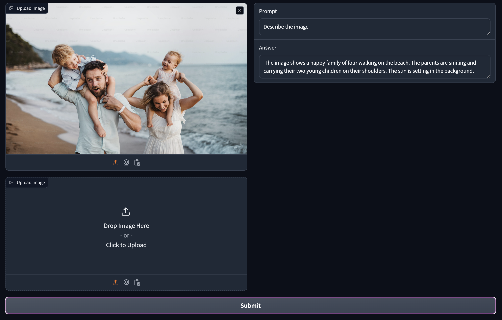

# AI Vision App [PoC]
Leveraging the Gen AI Vision models for image understanding, we use a UI built with Gradio.




## How to run the gradio App?

1. Create a virtual environment and set the `GOOGLE_API_KEY` environment variable.
2. Install dependencies using `make`:
   ```bash
   make install-requirements
   ```
3. Run the app:
   ```bash
   make run
   ```
4. The demo below will open in a browser on http://localhost:7860
