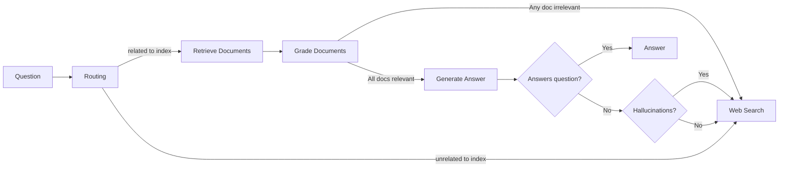

```mermaid
flowchart LR
    A[Question] --> B[Routing]
    B -->|related to index| C[Retrieve Documents]
    B -->|unrelated to index| F[Web Search]
    C --> D[Grade Documents]
    D -->|Any doc irrelevant| F[Web Search]
    D -->|All docs relevant| E[Generate Answer]
    E --> G{Answers question?}
    G -->|Yes| H[Answer]
    G -->|No| I{Hallucinations?}
    I -->|Yes| F
    I -->|No| F
``` 